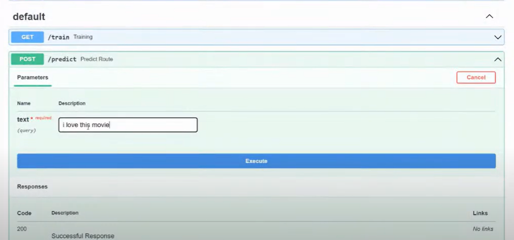

## Hate Speech Detection with LSTMs, GCP, and FastAPI

## Table of Contents

1. [About The Project](#about-the-project)
   - [Built With](#built-with)
2. [Getting Started](#getting-started)
   - [Prerequisites](#prerequisites)
   - [Installation](#installation)
3. [Usage](#usage)
4. [Blog](#blog)
5. [Contact](#contact)

---

## About The Project

This project implements an end-to-end hate speech detection system using LSTMs, GCP, and FastAPI. It covers the entire machine learning pipeline, from data ingestion and transformation to model training, evaluation, and deployment.  The system leverages LSTMs for accurate text classification, GCP for scalable model storage and versioning, and FastAPI for creating a user-friendly API.  Key features include modular components for each stage of the pipeline, handling of data imbalance, and comprehensive logging.  The project structure is organized for maintainability and scalability, with configuration files, artifacts, and clear separation of concerns.  Users can easily train new models, evaluate performance, and access predictions via the API.

### Topics Implemented:
- Natural Language Processing (NLP)
- Long Short-Term Memory (LSTM) networks
- Model Training and Evaluation Pipeline
- Data Imbalance Handling
- API Development (FastAPI)

---

## Getting Started

### Introduction

This project provides a practical, end-to-end implementation of a hate speech detection system. It demonstrates the complete machine learning lifecycle, from data acquisition and preprocessing to model training, evaluation, and deployment.  Leveraging the power of Long Short-Term Memory (LSTM) networks, this system effectively identifies hate speech in text.  A key aspect of this project is its cloud-native architecture, utilizing Google Cloud Platform (GCP) for scalable model storage and version control.  The trained model is then exposed as a readily accessible API using FastAPI, enabling seamless integration with other applications.  This project serves as a valuable resource for learning how to build and deploy a real-world hate speech detection system, addressing critical practical considerations such as data imbalance and model optimization.

### Prerequisites
- Python 3.6+
- TensorFlow
- NLTK
- FastAPI
- Google Cloud Platform (GCP) Account
- GCP Credentials
- Docker

### Installation

1. **Download Python Packages**
2. **GCP SDK**

### Blog

[https://medium.com/@pramatheshts025/a-practical-guide-to-hate-speech-detection-with-lstms-gcp-and-fastapi-a999cf529a65](https://medium.com/@pramatheshts025/a-practical-guide-to-hate-speech-detection-with-lstms-gcp-and-fastapi-a999cf529a65)

### Contact
### _Pramathesh T S_

**Email ID** - pramatheshts025@gmail.com 
**LinkedIn** - [https://www.linkedin.com/in/pramatheshts1999/](https://www.linkedin.com/in/pramatheshts1999/) 
**GitHub**   - [https://github.com/Pramathesh690/](https://github.com/Pramathesh690/)

